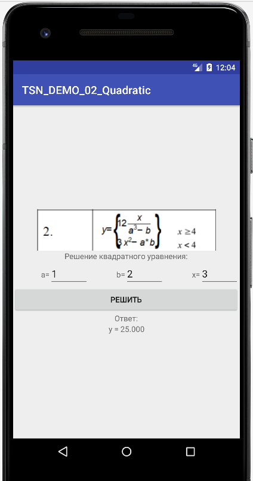

# AndroidTable
**Работа с несколькими разметками**

^^^if (x >= 4){
                y = 12 * (x/((a * a * a) - b));
            }
            else{
                y = (3 * (x * x)) - (a * b);
            }
            ^^^
